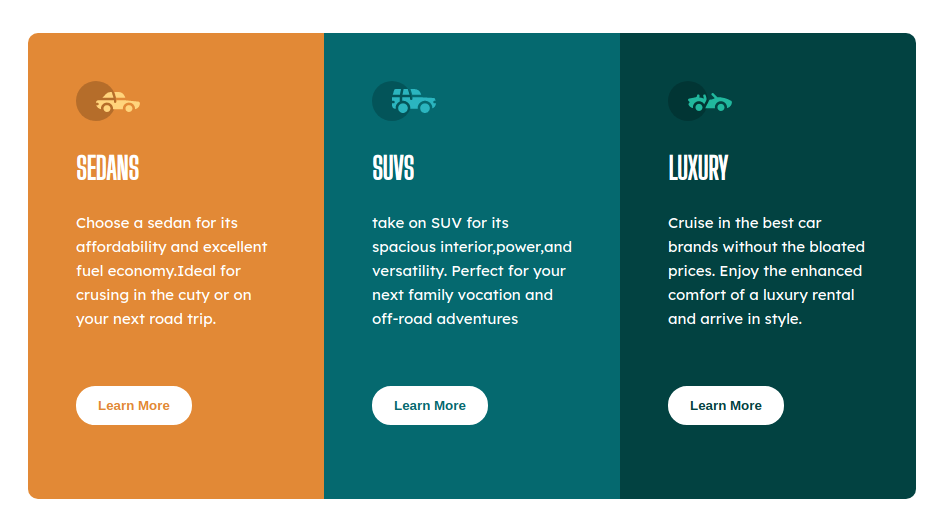
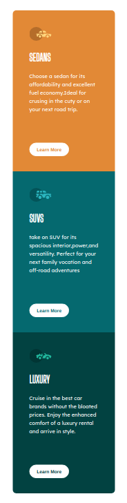

# 3-column preview card component

## Sobre o projeto

Esta é uma solução do frontend Mentor com o objetivo de construir um cartão de visualização com 3 colunas e torná-lo o mais semelhante possível ao projeto original. Nele, o usuário deve ser capaz de visualizar o cartão em qualquer dispositivo.

## Layout Desktop

## layout Mobile

# Estilização utilizada

## Cores

### Primária

- Bright orange: hsl(31, 77%, 52%) 
- Dark cyan: hsl(184, 100%, 22%) 
- Very dark cyan: hsl(179, 100%, 13%)

### Neutra

- Transparent white (paragraphs): hsla(0, 0%, 100%, 0.75) 
- Very light gray (background, headings, buttons): hsl(0, 0%, 95%)

## tipografia

### Body

- Font size: 15px

### Font

- Family: Lexend Deca

- Weights: 400

- Family: Big Shoulders Display

- Weights: 700

# Tecnologias utilizadas

## Front end

- HTML / CSS 

## Implantação em produção

- Front end web: Netlify

  https://card3-column.netlify.app/
  
# Meu aprendizado neste projeto
  
  Com esta solução pude aprender a deixar o html mais organizado, utilizando tags como " main " e " section ". Neste projeto também aprendi a trabalhar melhor com porcentagem, em especifico na centralização do conteudo no meio da tela e na responsividade. 
  
# Autor

Wesley higino Pereira

https://www.linkedin.com/in/wesleyhigino/